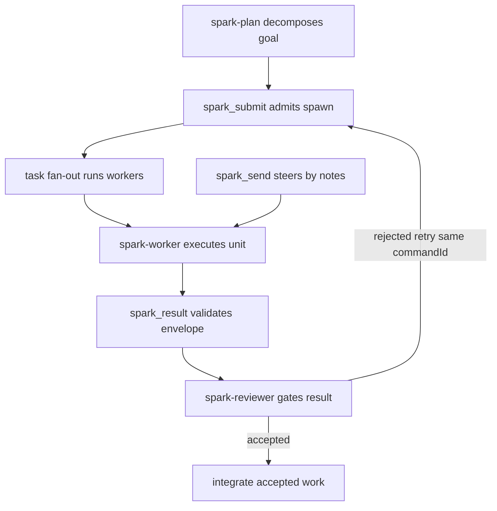

# opencode-muse-agents

Run subagents that survive crashes, respect capacity, and return results you can trust. This plugin ports Muse Code's coordination core to OpenCode: every spawn, steer, message, and verdict is a validated ledger record, not a live-session hope.

- Durable children: each worker is a committed record with lineage, worktree, and completion contract; lifecycle runs through 8 control statuses (`src/child.ts: CONTROL_STATUS`).
- Ledger mailbox: messages append first, then admit; delivery uses a closed set of 9 policies (`src/mailbox.ts: DELIVERY_POLICIES`); unknown combos fail closed.
- Admission control: spawns pass resolve, capacity, and depth gates mapped from 12 Agent RPC verbs (`src/verbs.ts: AGENT_VERBS`); rejections are keyed errors, never prose.
- Bounded results: worker envelopes cap summary at 512 chars and text at 32 KiB (`src/envelope.ts: SUMMARY_MAX_CHARS`, `RESULT_TEXT_MAX_BYTES`); over-cap input is rejected, never truncated.

## Install

npm plugin (recommended):

```sh
npm i opencode-muse-agents
```

```json
{ "plugin": ["opencode-muse-agents"] }
```

Copy-install (no npm):

```sh
cp -r bundle/agents bundle/tools bundle/plugins bundle/skills bundle/commands .opencode/
scripts/merge-fragment.sh ./opencode.json
```

`scripts/merge-fragment.sh [TARGET]` deep-merges `bundle/opencode.fragment.json` (agents, `subagent_depth: 2`, skill permissions) into your `opencode.json`, backs up the target first, and is a no-op on re-run. Details in `bundle/README.md`.

## Quickstart (60 seconds)

1. `/spark-plan <goal>` — decompose into worker-sized units with inputs, worktree, budget, and evidence.
2. `/spark-start` — coordinator admits each worker via `spark_submit`, fans out, steers by mailbox notes only.
3. `/spark-review <output>` — reviewer gates every result; integrate only accepted work in your session.

Retry rule: same `commandId` to reconcile, never a new one. Workers never redelegate.

Coordinator loop:



## How it works

Spawns commit validated records before anything runs; capacity and lineage gate admission; messages append to a ledger then admit through policy; results return as bounded envelopes folded into the parent.
Full design in `docs/OVERVIEW.md`.
Diagrams in `docs/ARCHITECTURE.md`.

## Tools

| Tool | Purpose |
|---|---|
| `spark_send` | Append a note to a session mailbox ledger; unknown policies fail closed. |
| `spark_submit` | Admit a worker spawn; returns commit fields or a keyed rejection. |
| `spark_result` | Validate a bounded result envelope; never truncates. |
| `spark_decide` | Run ordered judge candidates; only durable verdicts count. |
| `spark_fork` | Record a history-branch fork; cut cursor is display-only. |
| `spark_intake` | Run an ordered steering intake; bad input returns status 255. |
| `spark_registry` | Durable JSONL table ops; locked tables refuse with FENCED. |
| `spark_steer` | Steer a worker via owner drivers; lifecycle verbs need an idle target. |
| `spark_worktree` | Place or delete an isolated worktree under `.muse/worktrees`. |
| `spark_errors_errors_lookup` | Resolve a keyed error; unknown keys fail closed. |
| `spark_errors_errors_catalog` | List all catalogued error keys. |
| `spark_intake_intake_kind_index` | Resolve an intake kind to its jumptable index (-1 when unknown). |
| `spark_uuid_uuid_mint` | Mint a UUIDv7 command id; reuse the same id on retry. |
| `spark_uuid_uuid_canonicalize` | Render 32 hex chars as canonical hyphenated Event ID. |
| `spark_uuid_uuid_check` | Check canonical Event ID spelling. |
| `spark_worktree_worktree_bind_verdict` | Bind-verify verdict check; 3/4 need follow-up calls. |

## Tests

```sh
bun install && bun test && bun run build
```

## Versions

Bundle, Muse Code, and schema-fingerprint pins live in `docs/VERSIONS.md`. A new Muse Code release re-runs the harvest; any fingerprint or vocabulary delta opens a bundle patch before a new row is added.

## Provenance


Design is ported from reverse-engineering evidence: method and confidence map in `docs/RE-OVERVIEW.md`, full teardown in `research/` (entry `research/README.md`). Historical source: <https://github.com/karimkfoure/muse-code-teardown>.

## Research

Everything under `research/` is the Muse Code teardown that produced this design.
Start at `research/README.md` for the map (tracks, artifacts, Ghidra pointers).
Big binaries and analysis state are git-ignored and regenerable via package tools.
`research/` never ships in npm and never affects tests.
