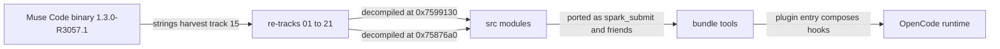
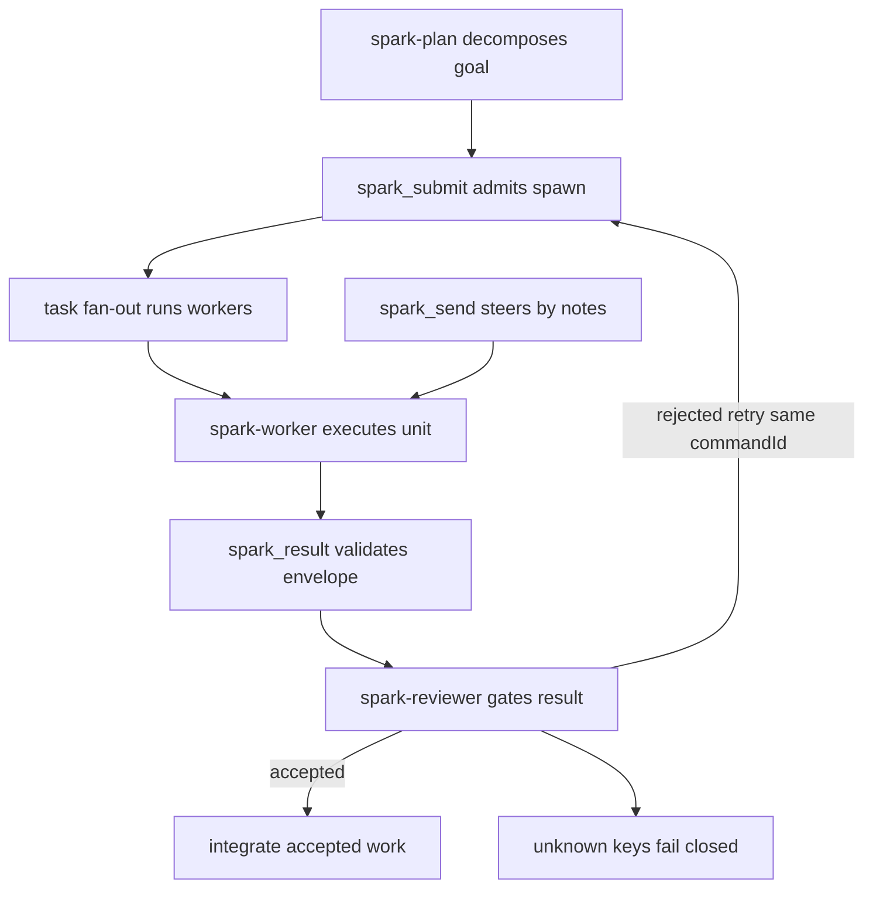
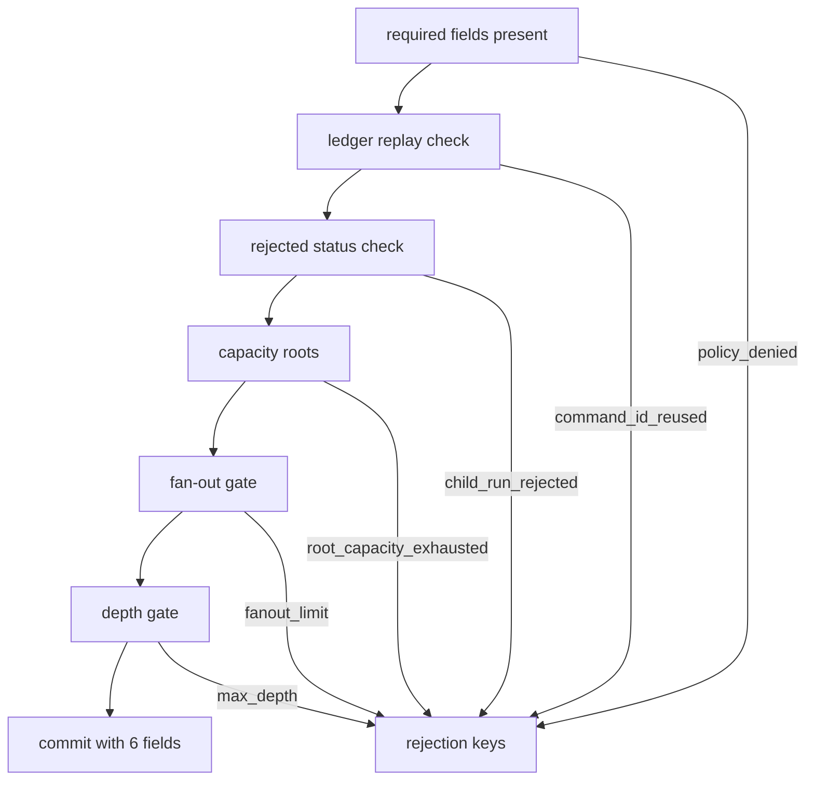
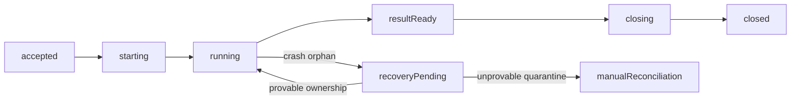
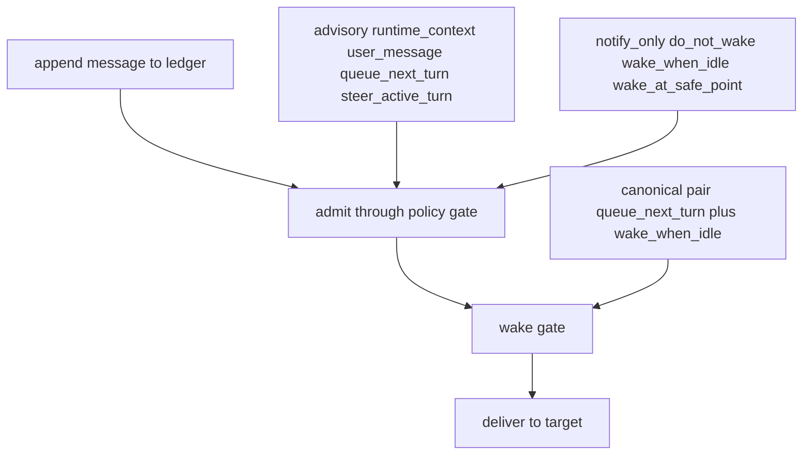

# ARCHITECTURE — visual map of the port

Muse Code keeps coordination truth in a durable log, not in live sessions. This plugin ports that shape to OpenCode. Each picture below traces one mechanism from binary evidence to runtime behavior. Vocabulary matches `src/` exactly. Full prose in `docs/OVERVIEW.md`. Evidence method in `docs/RE-OVERVIEW.md`.

## 1. Provenance map

From the Muse Code binary to the OpenCode runtime. Every edge names its evidence.

`0x7599130` is `subagent_spawn_validate` (track 08). `0x75876a0` is `owner_child_control` (tracks 08, 12). Track 15 is the verbatim vocabulary harvest across all 7 builds.

## 2. Coordinator loop

Plan once, admit every worker, steer by mailbox notes, gate every result. Retry reuses the same `commandId`. Workers never redelegate.

Envelopes stay bounded (summary 512 chars, text 32 KiB). Rejections carry catalog keys, never prose.

## 3. Spawn admission chain

Checks run in binary order. Any gate can refuse with a keyed error. Success commits 6 fields.

The 6 commit fields are `schema_version`, `spawn_decision`, `parent_binding`, `agent_lineage_admission`, `accepted`, `description`. Identical replay under the same `commandId` rejoins. Different payload under the same id is `command_id_reused`.

## 4. Child lifecycle

Six control statuses form the happy path. Two more cover crash recovery. `closed` is terminal.

Order and names are verbatim `src/child.ts` `CONTROL_STATUS`. Recovery follows tracks 02 and 13. Quarantine retains, never deletes.

## 5. Mailbox

Append first, then admit. The policy gate checks the closed 9-enum. The wake gate wakes only idle and unfinished targets.

Non-canonical combos fail closed. `steer_active_turn` needs a running target. `queue_next_turn` plus `wake_when_idle` is the canonical pair.

## 6. Module to track traceability

Each `src/` module with the evidence track that produced it and the binary address where one exists. `harness` means OpenCode-side glue with no direct binary address.

| src module | re-tracks | binary address |
|---|---|---|
| admission.ts | 08, 17 | 0x7599130 |
| child.ts | 10 | 0x6d81730 |
| contract.ts | 10, 15 | none, vocabulary only |
| control.ts | 08, 12 | 0x75876a0 |
| envelope.ts | 01, 20 | 0xa81b980 |
| errors.ts | 08, 15 | 0x759a200 |
| fold.ts | 11 | 0x772a830 |
| fork.ts | 02, 07b | 0x556e5d0 |
| globals.d.ts | harness | none |
| ids.ts | 08, 15 | 0x6c61450 |
| intake.ts | 19 | 0x5a1fb80 |
| mailbox.ts | 03, 09 | 0x119b738 |
| paths.ts | harness, 13 | none |
| plugin.ts | harness, 04, 05 | none |
| policy.ts | 03, 08 | 0x6aff010 |
| precall.ts | harness, 15 | none, strings only |
| recovery.ts | 02, 13 | none, first-class paths |
| registry.ts | 14, 15 | none, table layout |
| render.ts | 11 | 0x772a830 |
| verbs.ts | 09 | 0x118f1dc |
| worktree.ts | 02, 13, 18 | 0x6e85ac0 |
